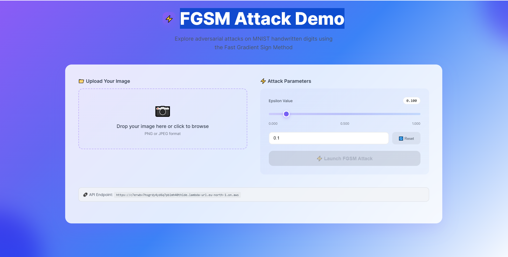
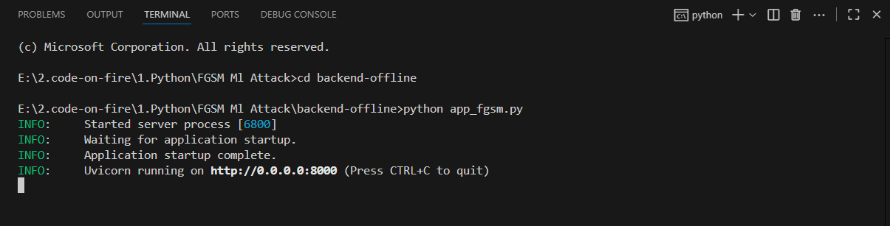
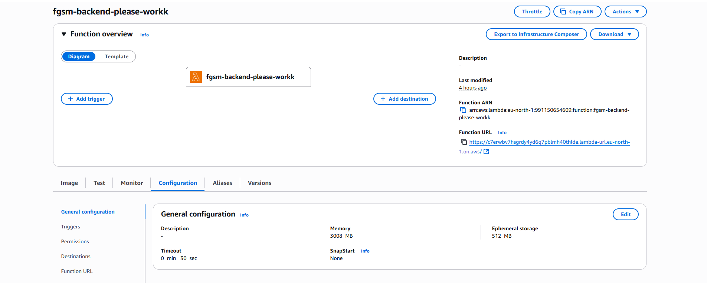
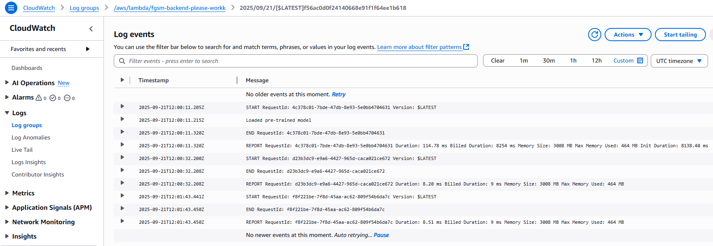
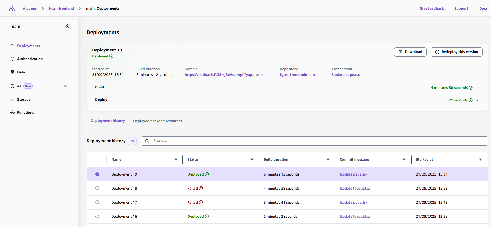

# FGSM-ML-Attack

A comprehensive implementation of Fast Gradient Sign Method (FGSM) adversarial attacks on machine learning models, featuring both local and cloud deployment options.

## What is FGSM?

Fast Gradient Sign Method (FGSM) is an adversarial attack technique that generates adversarial examples by adding small perturbations to input data. These perturbations are calculated using the gradient of the loss function with respect to the input, scaled by a small epsilon value. The attack can fool machine learning models into making incorrect predictions while the changes remain imperceptible to humans.

## Project Structure

The project consists of three main components:

- **Backend Offline**: FastAPI server for local development and testing
- **Docker Online**: Containerized backend for AWS Lambda deployment
- **FGSM Frontend**: Web interface that can run both locally and online

## Live Demo

The frontend is hosted at: https://main.d3sfs35rsj3o4s.amplifyapp.com/

## Preview



*Screenshot showing the FGSM attack interface with original and adversarial images*

## Server-Side Deployments

This project demonstrates multiple deployment strategies for robust server-side implementation:

### Local Development Environment

*FastAPI server running locally on localhost:8000 with Swagger documentation*

### AWS Lambda Container Deployment

*AWS Lambda function configured with 3002 MB memory and 30s timeout*


*Lambda function successfully processing FGSM attack requests*

### Frontend Deployment on AWS Amplify

*Frontend successfully deployed and running on AWS Amplify*

### End-to-End System Operation

*Complete system showing local backend, cloud deployment, and frontend integration*

## Setup Instructions

### Backend Offline (Local FastAPI Server)

The backend offline component runs a FastAPI server locally on your PC for development and testing purposes.

#### Prerequisites
- Python 3.8+
- pip package manager

#### Installation & Running
1. Navigate to the backend offline directory
2. Install dependencies:
   ```bash
   pip install -r requirements.txt
   ```
3. Run the FastAPI server:
   ```bash
   uvicorn main:app --reload
   ```
4. The server will be available at `http://localhost:8000`
5. API documentation will be accessible at `http://localhost:8000/docs`

### Docker Online (AWS Lambda Deployment)

The Docker online component creates a containerized version of the backend for deployment on AWS Lambda.

#### Prerequisites
- Docker installed on your system
- AWS CLI configured
- AWS Lambda access

#### Building and Deploying
1. Navigate to the docker online directory
2. Build the Docker image:
   ```bash
   docker build -t fgsm-ml-attack .
   ```
3. Tag and push to AWS ECR (replace with your repository URI):
   ```bash
   docker tag fgsm-ml-attack:latest <aws-account-id>.dkr.ecr.<region>.amazonaws.com/fgsm-ml-attack:latest
   docker push <aws-account-id>.dkr.ecr.<region>.amazonaws.com/fgsm-ml-attack:latest
   ```

#### AWS Lambda Configuration
When setting up your Lambda function:
- **Memory**: Set to **3002 MB**
- **Timeout**: Set to **30 seconds**
- **Runtime**: Use container image deployment
- Point to your ECR repository image

### FGSM Frontend

The frontend provides a user-friendly interface for interacting with the FGSM attack functionality.

#### Running Locally
1. Navigate to the frontend directory
2. Install dependencies:
   ```bash
   npm install
   ```
3. Start the development server:
   ```bash
   npm start
   ```
4. Open `http://localhost:3000` in your browser

#### Online Deployment
The frontend is already deployed and accessible at:
https://main.d3sfs35rsj3o4s.amplifyapp.com/

## Usage

1. **Upload Image**: Select an image file to test the FGSM attack on
2. **Configure Parameters**: Set the epsilon value and other attack parameters
3. **Run Attack**: Execute the FGSM algorithm to generate adversarial examples
4. **View Results**: Compare the original and adversarial images, along with model predictions

## API Endpoints

The backend provides the following endpoints:

- `POST /attack` - Execute FGSM attack on uploaded image
- `GET /health` - Health check endpoint

## Technical Details

The implementation includes:
- Multiple pre-trained models for testing
- Configurable epsilon values for attack strength
- Image preprocessing and postprocessing pipelines
- Real-time visualization of attack results
- Support for various image formats

## Development

For local development:
1. Start the backend offline server
2. Run the frontend in development mode
3. The frontend will automatically connect to the local backend

For production deployment:
1. Deploy the Docker container to AWS Lambda
2. Update frontend configuration to point to Lambda endpoint
3. Deploy frontend to your hosting platform

## Architecture

```
Frontend (React/Vue/HTML) ←→ Backend API ←→ ML Models
                                    ↓
                            FGSM Attack Engine
```

The system processes images through the FGSM algorithm, generating adversarial examples that demonstrate vulnerabilities in machine learning models.
